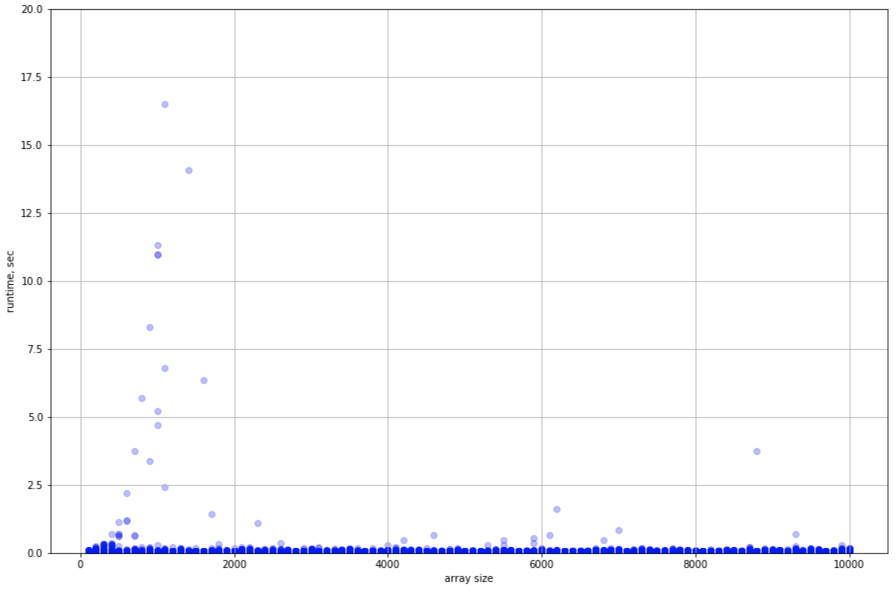

# Subset Sum problem

Each problem requires a solution. And the subset sum problem is not an exception.
Here, you can find an algorithm that effectively solves this problem in natural numbers for density > 1.

Where density is:

```math
d = n / log2(max(S))
```

## A formal definition of the subset sum problem

- A set of positive integers S is given

- Also given a target X

- Find a subset s ∈ S such as:

```math
\sum_{i=0}^n s_n = X
```

## Usage

Achtung! Windows support was not properly implemented and tested!

To get started:

```shell
git clone git@gitlab.com:kirilenkobm/ssp.git
cd ssp
./_test.sh
```

To generate datasets:

```shell
make rnd
./bin/generate_input [num_num] [max_num] [min_num] [to_ans] [output_file]
```

To repeat dataset I used for evaluations:

```shell
./create_test_set.sh
```

SSP.py usage:

```txt
usage: SSP.py [-h] [--subset_size SUBSET_SIZE] [--get_density] [--deep]
              [--verbose] [--ext_out]
              input requested_sum

positional arguments:
  input                 Text file containing input numbers, or stdin stream,
                        just write stdin for that
  requested_sum         Sum requested

optional arguments:
  -h, --help            show this help message and exit
  --subset_size SUBSET_SIZE, -s SUBSET_SIZE
                        Specify particular size of subset, look only for this
  --get_density, --gd   Compute dataset density
  --deep, -d            Include deep target search, drastically increases the
                        runtime
  --verbose, -v         Show verbose messages.
  --ext_out, -e
```

## Implementation details and limitations

The main part of the software is implemented in both Python and C.
C code is designed to be compiled as a shared library.
In turn, Python script "SSP.py" is wrapped around the shared library, taking care of argument parsing and verification of input.
Actually, the compiled library might be simply used individually, apart from the python script.
The minimal input for the Python wrapper is a text file with an integer number at each line (might be stdin as well) and an integer, representing the target.

The limitations are:

- The C-written path actively uses uint64_t data type, maximal capacity of which is 18446744073709551615, the majority of limitations are closely related to this number.

- All input numbers must be positive integers, zeros are allowed but don't make any sense in the context of problem.

- Number of input elements should not exceed the uint64_t maximal capacity.

- Each input number also should not exceed the uint64_t capacity.

- The most regrettable restriction - input array sum also should not exceed the uint64_t capacity due to the algorithm design. Shifting of this limit to __uint128_t capacity is planned.

- Requested sum cannot be smaller than the smallest element of array.

- Also, the target should not be bigger than he overall sum of input array.

Master script SSP.py and C code don't require any external libraries.

## Performance measurements

Algorithm complexity in the __worst__ case:

```math
O(N^3)
```

Performance tests vere performed with variable array lengths and forming answer subset sizes.
The program was tested on 6300 independent datasets.
Max number was fixed to 10M. Subset sums that form answer were 25, 50 and 75% of overall dataset size.
Density varied from 6.32 to 632.38.
In 100% cases the program found a subset with requested sum.

Overall picture:



Shows that in general program works very fast, and in some minor cases the runtime is almost awful.

Zoomed in:


Shows that runtime grows very slow in average.

For this plot only the cases that took > 0.2 sec vere selected:


Shows that even in the worst case the runtime grows not faster than N^3 / C.
